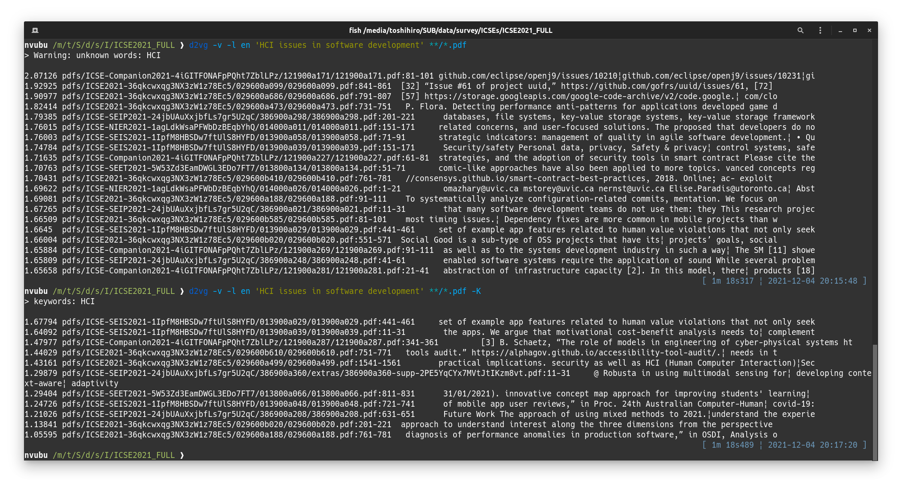

# d2vg

d2vg, A Doc2Vec grep.

Doc2Vecモデルを使って、クエリのフレーズに似た部分を含む文書ファイルを検索します。

* テキストファイル（.txt）、PDFファイル（.pdf）、MS Wordファイル（.docx）からの検索に対応
* 対応言語は日本語、英語。実験的に、中文、韓国語に対応しました。
* インデックス化を行うことで性能向上

## インストール

&rarr; [Ubuntuでのインストール](docs/installation-on-ubuntu.ja_JP.md)  
&rarr; [Windowsでのインストール](docs/installation-on-windows.ja_JP.md)  

中文の場合は、インストールの手順で、次の行の`d2vg[ja]`を`d2vg[zh]`に変更してください。
韓国語の場合は、同様に、`d2vg[ja]`を`d2vg[ko]`に変更してください。

```sh
pip3 install d2vg[ja]
```

## 利用法

```sh
d2vg -v <クエリとなるフレーズ> <ファイル>...
```

英語のドキュメントとして検索する場合には、オプション `-l en` を指定してください:

```sh
d2vg -l en -v <query_phrase> <files>...
```

実行例:  


### オプション

`d2vg`にはいくつかオプションがあります。よく使われるであろうものを説明します。

`--verbose, -v`  
Verboseオプションです。指定すると、検索の進行中に、その時点までの進捗状況や、最も類似度の高いドキュメントを表示します。

`--lang=LANG, -l LANG`  
言語に対応したDoc2Vecモデルを選択します。使用可能な言語は、`en`、`ja`、`ko`、`zh`です。

`--unknown-word-as-keyword, -K`  
クエリが未知の単語を含む場合、そのような単語はキーワードとみなされます。クエリにマッチし、キーワードを含むドキュメントのみが検索結果として返されます。

`--topn=NUM, -t NUM`  
上位のNUMドキュメントを結果として表示します。既定値は20です。
0を指定すると、検索されたすべての文書を、クエリとの一致度でソートして表示します。

`--paragraph, -p`  
このオプションを指定すると、1つの文書ファイル内のそれぞれのパラグラフがドキュメントとみなされます。検索結果に一つの文書ファイルの複数の段落が出力されるようになります。
このオプションが指定されていない場合、1つの文書ファイルが1つのドキュメントとみなされます。検索結果に一つの文書ファイルはたかだか1回だけ表示されます。

`--window=NUM, -w NUM`  
この数字で指定された行のかたまりを1つの段落として認識します。
既定値は20です。

`--unit-vector, -u`  
クエリとの類似性を計算するとき、文書の分散表現であるベクタを単位ベクトルへと正規化します。パラグラフの長さの差が大きい場合は、短いパラグラフが優先的に検索結果に表示されるようになります。

`--worker=NUM, -j NUM`  
ワーカープロセスの数。0を指定するとCPUコア数と解釈されます。
これにより、特にインデックスが作成されていない文書から検索する場合に、検索速度が向上する可能性があります。

### キーワード検索

オプション`-K`をつけると、クエリのフレーズ中に（Doc2Vecモデルの）未知語があった場合は、それらの語をキーワードに指定します。
キーワードが指定された場合は、キーワードがすべて含まれる部分のみが検索結果に表示されます。さらに、指定されたキーワードが「`> keywords:`」という行に表示されます。

実行例: 「HCI」がキーワードに指定された例  


### インクリメンタルなインデックス化

d2vgに文書（検索対象のファイル）のインデックスを作成させることで、同じ文書（の集合）から何度も検索を行う場合に、2回目以降の検索の速度を向上させることができます。

d2vgは以下の条件のときに、インデックスDBを作成して参照します。

* d2vgを実行するときのカレントディレクトリに`.d2vg`というサブディレクトリがある
* 対象の文書ファイルが相対パスで指定されている

インデックス化を開始するには、文書ファイルがあるディレクトリに行って、 `.d2vg` ディレクトリを作成してください。

```sh
cd 文書ファイルのディレクトリ
mkdir .d2vg
```

インデックスDBは検索を行う度にインクリメンタルに更新されます。
すなわち、新しい文書ファイルが追加されて検索の対象になったタイミングで、その文書のインデックスを作成しインデックスDBに追加します。

その一方で、削除された文書ファイルのインデックスをデータベースから自動的に削除する機能は無いので、必要に応じて明示的に`.d2vg`ディレクトリを削除してください。

```sh
cd 文書ファイルのディレクトリ
rm -rf .d2vg
```

DOSプロンプトやPowershellの場合は、それぞれ、`rd /s /q .d2vg`あるいは`rm -r -fo .d2vg`としてください。

インデックス化を有効にしたときの実行例:  
(この例では、インデックス化をしていないときは70秒以上かかっていたものが、4秒に短縮されました。)  


### 明示的なインデックス化とインデックス内からの検索

特に、数百万といった個数の文書ファイルを対象とした検索を想定して、明示的にインデックスを作成し、そのインデックス内から検索する方法があります。

明示的なインデックス化により生成されるインデックスDBは、通常のインクリメンタルなインデックス化により作成されるものと全く同じです。
したがって、明示的なインデックスの作成やインデックス内からの検索は、インクリメンタルなインデックス化と混ぜて利用することができます。例えば、インデックスの生成をインクリメンタルなインデックス化により行い、検索はインデックス内から行う、といったことが可能です。

(1) インデックスの作成

このインデックスの作成では、ワーカープロセスの数だけDoc2Vecモデルをロードし、並列にインデックスを生成してインデックスDBに格納していきます。大量のメモリが必要となるので注意してください。

```sh
cd 文書ファイルのディレクトリ
d2vg --build-index -j <ワーカープロセスの数> <ファイル>...
```

インクリメンタルなインデックス化の場合の`-j`オプションは文書ファイルからのテキストの読み出しやトークン化（単語の並びへと変換）の処理を並列化するのに対して、明示的なインデックス化の場合の`-j`オプションは単語の並びをベクトルに変換する処理を並列化します。

(2) インデックス内からの検索

インデックスDBに対して、並列に問い合わせを行います。インデックスDBにない文書ファイルは検索の対象にならず、また、インデックスDBが更新されることもありません。

```sh
cd 文書ファイルのディレクトリ
d2vg -C -j <ワーカープロセスの数> <クエリとなるフレーズ>
```

(3) インデックス化された文書ファイルの表示

 データベースにインデックスデータが格納されている文書ファイルのリストを出力します。
ファイル数が多い場合は-jオプションを使って並列に実行することをおすすめします。

```sh
cd 文書ファイルのディレクトリ
d2vg --list-indexed -j <ワーカープロセスの数>
```

## トラブルシューティング

**Q**: Doc2Vecモデルをインストールしたのに「`Error: not found Doc2Vec model for language: jp`」というエラーが出ます。  
**A**: 言語の指定が間違っています。「`jp`」ではなく「`ja`」です。

**Q**: d2vgがハングアップします。  
**A**: インデックス化が有効な（ディレクトリ`.d2vg`を作成している）ときに、強制終了すると、次回実行時にインデックスDBが開けなくなってハングアップすることがあるようです。ディレクトリ`.d2vg`を削除してください。

## 開発

Doc2Vecモデルの作成の方法については、`making_doc2vec_model/`にある、Doc2Vecモデルを作成したスクリプトを参考にしてください。
モデルを作成するときのパラメーターについては、スクリプトの`trim_docs.py`や`train.py`のヘルプメッセージが参考になるかもしれません。

添付しているモデルは、言語によって異なりますが、語彙が4万語から6万5千語であり、文書を100次元のベクトル（離散表現）に変換するものです。
不足していると感じる場合には、スクリプトを利用して、強化したより良いモデルを作成してください。
添付しているモデルを作成するときに利用したパラメータは、その言語で利用可能なコーパスの文書量や、含まれている語彙の量に大きく依存したものです。また、githubのリリースページでの単一ファイルの上限に収まるサイズになるように調整されています。

**協力のお願い**: 特に自分の母国語の日本語以外については、モデルを十分にチューニングできているかどうか自信がありません。モデルの作成に興味を持たれている方、プルリクエスト、作成したモデルを公開しているURL等、大歓迎です。 &#x1f647;

### Doc2Vecモデルの配布ファイル

Doc2Vecモデルは、Gensim v4で作成されたものとしてください。
`<言語.ref>`というファイル(「言語」はオプション`-l`で指定する言語の名前です)に、Doc2Vecモデルのファイルへの相対パスを記述してください。

例えば、日本語のDoc2Vecモデルの場合には、`ja.ref`というファイルの中身は`jawiki-janome-m100-c400-d100.model`という行になっています。

```
~/.config/d2vg/models/jawiki-janome-m100-c400-d100
├── ja.ref
├── jawiki-janome-m100-c400-d100.model
└── jawiki-janome-m100-c400-d100.model.dv.vectors.npy
```

## Todo

- [x] ドキュメントファイルのインデックス化の導入による最適化
- [x] 最新版のgensim (gensim v4)と互換性のあるDoc2Vecデータの準備
- [x] Windowsでのインストールを確認
- [x] キーワード検索の併用
- [x] インストールを容易に
- [ ] より多くの言語サポートおよびチューニング(実験的サポート: ko, zh)
- [x] 検索対象の文書ファイルが数百万個になったときのための明示的なインデックス化コマンド (v2)

## 謝辞

Doc2Vecモデルの作成には次のサイトを参考にしました:  
[日本語Wikipediaで学習したdoc2vecモデル](https://yag-ays.github.io/project/pretrained_doc2vec_wikipedia)

`ko`と`zh`のDoc2Vecモデルの作成は、次のソースを参考にしました:  
https://github.com/Kyubyong/wordvectors/blob/master/build_corpus.py

膨大な言語コーパスを提供されているWikipediaに感謝いたします:  
https://dumps.wikimedia.org/

## ライセンス

d2vgは [BSD-2](https://opensource.org/licenses/BSD-2-Clause) ライセンスで配布されます。
