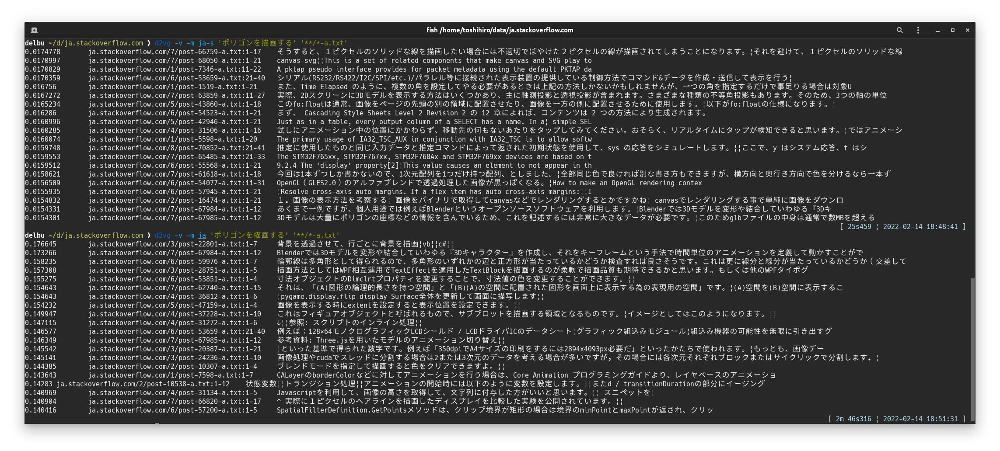
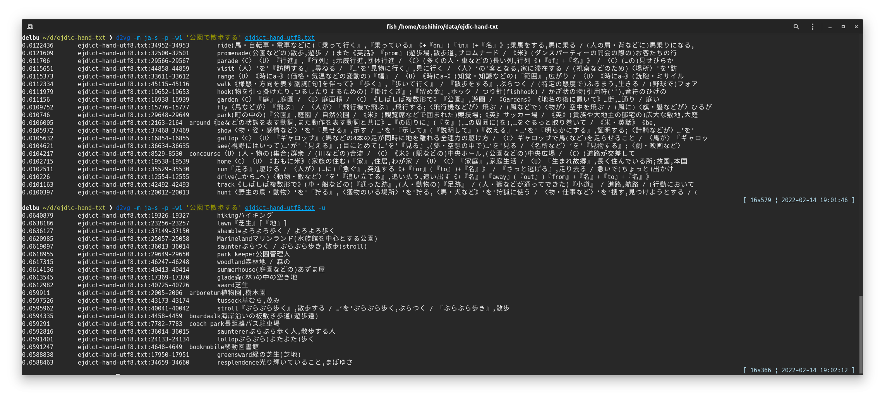

# d2vg

d2vgはDoc2Vecによるgrepです（ただし、sentence transformerのモデルも利用します）。

Doc2Vecモデルやsentence transformerモデルを使って、クエリのフレーズに似た部分を含む文書ファイルを検索します。

* テキストファイル（.txt）、PDFファイル（.pdf）、MS Wordファイル（.docx）からの検索に対応
* インデックスDBにより検索性能を向上

## インストール

&rarr; [Ubuntuでのインストール](docs/installation-on-ubuntu.ja_JP.md)  
&rarr; [Windowsでのインストール](docs/installation-on-windows.ja_JP.md)  

デフォルトで、`d2vg`は多言語に対応したsentence transformerモデルを検索に利用します。

## 利用法

```sh
d2vg -v <クエリとなるフレーズ> <文書ファイル>...
```

検索の実行例:  


この実行例では、441個の英文のPDFファイルから検索を行っています。デフォルトのモデルを利用していて、メモリ利用量のピークは5.4GiBでした。

### TL;DR（典型的な利用法）

（インストール時に「言語特化Doc2Vecモデルのインストール」を行っておいてください）

(1) 文書ファイルからクエリとなるフレーズに近いものを探す。

```sh
d2vg -v -m ja-s <クエリとなるフレーズ> <文書ファイル>...
```

(2) 文書ファイルからクエリとなるフレーズに近いものを探すが、何度も検索を繰り返すため、インデックス化を行う。
（このコマンドラインでは文書ファイルを相対パスで指定する必要があります。）

```sh
mkdir .d2vg
d2vg -v -m ja-s <クエリとなるフレーズ1> <文書ファイル>...
d2vg -v -m ja-s <クエリとなるフレーズ2> <文書ファイル>...
```

### コマンドラインオプション

`d2vg`にはいくつかオプションがあります。よく使われるであろうものを説明します。

`--verbose, -v`  
Verboseオプションです。指定すると、検索の進行中に、その時点までの進捗状況や、最も類似度の高いドキュメントを表示します。

`--model=MODEL, -l MODEL`  
デフォルト以外のモデルを利用します。使用可能なモデルは、`en-s`、`ja`、`ja-s`です。
このプションを利用しない場合は、デフォルトの多言語対応のモデルが利用されます。

`--top-n=NUM, -t NUM`  
上位のNUMドキュメントを結果として表示します。既定値は20です。
0を指定すると、検索されたすべての文書を、クエリとの一致度でソートして表示します。

`--paragraph, -p`  
このオプションを指定すると、1つの文書ファイル内のそれぞれのパラグラフがドキュメントとみなされます。検索結果に1つの文書ファイルの複数のパラグラフが出力されるようになります。
このオプションが指定されていない場合、1つの文書ファイルが1つのドキュメントとみなされます。検索結果に1つの文書ファイルはたかだか1回だけ表示されます。

`--window=NUM, -w NUM`  
この数字で指定された行のかたまりを1つのパラグラフとして認識します。
既定値は20です。

`--unit-vector, -u`  
クエリとの類似性を計算するとき、文書の分散表現であるベクタを単位ベクトルへと正規化します。パラグラフの長さの差が大きい場合は、短いパラグラフが優先的に検索結果に表示されるようになります。

`--worker=NUM, -j NUM`  
ワーカープロセスの数。0を指定するとCPUコア数と解釈されます。
これにより、特にインデックスが作成されていない文書から検索する場合に、検索速度が向上する可能性があります。

### 言語特化モデルの利用

日本語に関しては、次の3つのモデルを利用した検索を行うことができます。

* 多言語に対応したsentence transformerモデル(デフォルトで利用)
* 日本語Sentence Bertモデル`sonoisa/sentence-bert-base-ja-mean-tokens-v2` (オプション`-m ja`により利用)
* Wikipeida日本語版から生成した小型のDoc2Vecモデル(オプション`-m ja-s`により利用)

モデル`ja-s`の`-s`はsmallの意味です。デフォルトの多言語対応のモデルより語彙数もファイルサイズも小さく、実行時に必要なメモリの量も小さくなります。
同じ文書ファイルを対象とした検索であっても、デフォルトのモデルと`ja-s`とでは検索結果が異なります。

**現在のバージョンでは、日本語の文書を検索するときにはオプション`-m ja-s`または`-m ja`をつけることを推奨します。**

オプション`-m`の利用例]:  


(注意) 上述の小型Doc2Vecモデル(オプション`-m ja-s`)を利用するには、インストール時に「言語特化Doc2Vecモデルのインストール」を行っておく必要があります。

### インデックス化

&rarr; [インデックス化](docs/usage-indexing.ja_JP.md)

### テキストファイルの各行を検索する

オプション`--paragraph`と`--window=1`を同時に指定すると、テキストファイルの各行を対象とした検索を行うことができます。長いテキスト（長い行）のほうが検索結果に出やすくなるため、必要に応じて`--unit-vector`も指定してください。

辞書データ[ejdict-hand](https://github.com/kujirahand/EJDict)から検索した例:  


## トラブルシューティング

| 状況 | 対策 |
| --- | --- |
| d2vgの**インストールに失敗**する。「pdftotext」がインストールできないというエラーメッセージが出力される。 |  pdftotextは、pipコマンドだけではインストールできません。インストールの手順を参照してください。 |
| d2vgを実行しようとすると **「ModuleNotFoundError: No module named 'fugashi'」** といったエラーメッセージが出る。 | pipコマンドで`d2vg[ja]`のように`[ja]`をつけて再インストールしてください。 |
| d2vgを実行中に **「UnicodeEncodeError: 'cp932' codec can't encode character ...」** とっいたエラーメッセージが出る。 | ファイルの文字コードに関するエラーです。Windows上で実行している場合は「NKFのインストール」を行ってみてください。 |
| d2vgの**検索に時間がかかる**。 | `cuda`が有効にされた`torch`がインストールされていない場合には、デフォルトのモデルでは計算時間が長大になります。（状況に依存しますが、試しみたところでは他のモデルの10倍の時間がかかりました。）より軽量なモデルを使うには、インストール時に「言語特化Doc2Vecモデルのインストール」を行ったうえで、コマンドラインでオプション`-m ja-s`を指定してください。 |
| d2vgが**ハングアップする**。 | インデックス化が有効な（ディレクトリ`.d2vg`を作成している）ときに、強制終了すると、次回実行時にインデックスDBが開けなくなってハングアップすることがあるようです。ディレクトリ`.d2vg`を削除してください。 |

## Todo

- [x] パフォーマンス向上のためのDB構造の変更
- [x] 検索対象の文書ファイルが数百万個になったときのためのバッチによるインデックス化コマンド
- [x] sentence transformerモデルの利用
- [ ] ライセンスの互換性 (gensimは LGPL2)

## 謝辞

日本語のSentence Bertモデルは次を利用させていただきました:  
[sonoisa/sentence-bert-base-ja-mean-tokens-v2](https://huggingface.co/sonoisa/sentence-bert-base-ja-mean-tokens-v2)

Doc2Vecモデルの作成には次のサイトを参考にしました:  
[日本語Wikipediaで学習したdoc2vecモデル](https://yag-ays.github.io/project/pretrained_doc2vec_wikipedia)

膨大な言語コーパスを提供されているWikipediaに感謝いたします:  
https://dumps.wikimedia.org/

## ライセンス

d2vgは [BSD-2](https://opensource.org/licenses/BSD-2-Clause) ライセンスで配布されます。
