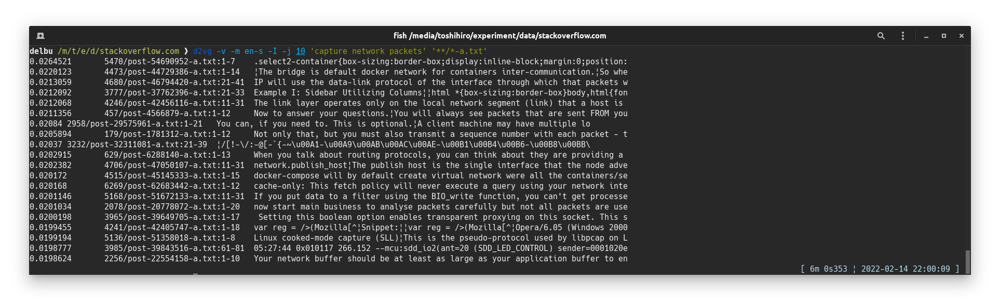

**ご注意: 現在devブランチではDBの構造を変更する実験が進行中です。アルファまたはベータのリリースで作成したインデックスDBは、正式リリースでは利用できません。**

# d2vg

d2vgはDoc2Vecによるgrepです（ただし、sentence transformersのモデルも利用します）。

Doc2Vecモデルやsentence transformersのモデルを使って、クエリのフレーズに似た部分を含む文書ファイルを検索します。

* テキストファイル（.txt）、PDFファイル（.pdf）、MS Wordファイル（.docx）からの検索に対応
* インデックス化を行うことで性能向上

## インストール

&rarr; [Ubuntuでのインストール](docs/installation-on-ubuntu.ja_JP.md)  
&rarr; [Windowsでのインストール](docs/installation-on-windows.ja_JP.md)  

デフォルトで、`d2vg`は多言語に対応したsentence transformersモデルを検索に利用します。

## 利用法

```sh
d2vg -v <クエリとなるフレーズ> <ファイル>...
```

検索の実行例:  


この実行例では、441個の英文のPDFファイルから検索を行っています。メモリ利用量のピークは5.4GiBでした。

### オプション

`d2vg`にはいくつかオプションがあります。よく使われるであろうものを説明します。

`--verbose, -v`  
Verboseオプションです。指定すると、検索の進行中に、その時点までの進捗状況や、最も類似度の高いドキュメントを表示します。

`--model=MODEL, -l MODEL`  
言語に対応したDoc2Vecモデルを選択します。使用可能なモデルは、`en-s`と`ja-s`です。
このプションを利用しない場合は、デフォルトの多言語対応のモデルが利用されます。

`--top-n=NUM, -t NUM`  
上位のNUMドキュメントを結果として表示します。既定値は20です。
0を指定すると、検索されたすべての文書を、クエリとの一致度でソートして表示します。

`--paragraph, -p`  
このオプションを指定すると、1つの文書ファイル内のそれぞれのパラグラフがドキュメントとみなされます。検索結果に一つの文書ファイルの複数のパラグラフが出力されるようになります。
このオプションが指定されていない場合、1つの文書ファイルが1つのドキュメントとみなされます。検索結果に一つの文書ファイルはたかだか1回だけ表示されます。

`--window=NUM, -w NUM`  
この数字で指定された行のかたまりを1つのパラグラフとして認識します。
既定値は20です。

`--unit-vector, -u`  
クエリとの類似性を計算するとき、文書の分散表現であるベクタを単位ベクトルへと正規化します。パラグラフの長さの差が大きい場合は、短いパラグラフが優先的に検索結果に表示されるようになります。

`--worker=NUM, -j NUM`  
ワーカープロセスの数。0を指定するとCPUコア数と解釈されます。
これにより、特にインデックスが作成されていない文書から検索する場合に、検索速度が向上する可能性があります。

### 言語特化モデルの利用

日本語に関しては、次の3つのモデルを利用した検索を行うことができます。

* 多言語に対応したsentence transformersモデル(デフォルトで利用)
* 日本語Sentence Bertモデル`sonoisa/sentence-bert-base-ja-mean-tokens-v2` (オプション`-m ja`により利用)
* Wikipeida日本語版から生成した小型のDoc2Vecモデル(オプション`-m ja-s`により利用)

モデル`ja-s`の`-s`はsmallの意味です。多言語対応のモデルより語彙数もファイルサイズも小さく、実行時に必要なメモリの量も小さくなります。
同じ文書ファイルを対象とした検索であっても、デフォルトのモデルと`ja-s`とでは検索結果が異なります。

**現在のバージョンでは、日本語の文書を検索するときにはオプション`-m ja-s`または`-m ja`をつけることを推奨します。**

オプション`-m`の利用例]:  


(注意) 上述の小型Doc2Vecモデル(オプション`-m ja-s`)を利用するには、インストール時に「言語特化Doc2Vecモデルのインストール」を行っておく必要があります。

### テキストファイルの各行を検索する

オプション`--paragraph`と`--window=1`を同時に指定すると、テキストファイルの各行を対象とした検索を行うことができます。日本語に特化したモデルでは、長いテキスト（長い行）のほうが検索結果に出やすくなるため、必要に応じて`--unit-vector`も指定してください。

辞書データ[ejdict-hand](https://github.com/kujirahand/EJDict)から検索した例:  


### インクリメンタルなインデックス化

d2vgに文書（検索対象のファイル）のインデックスを作成させることで、同じ文書（の集合）から何度も検索を行う場合に、2回目以降の検索の速度を向上させることができます。

d2vgは以下の条件のときに、インデックスDBを作成して参照します。

* d2vgを実行するときのカレントディレクトリに`.d2vg`というサブディレクトリがある
* 対象の文書ファイルが相対パスで指定されている

インデックス化を開始するには、文書ファイルがあるディレクトリに行って、 `.d2vg` ディレクトリを作成してください。

```sh
cd 文書ファイルのディレクトリ
mkdir .d2vg
```

インデックスDBは検索を行う度にインクリメンタルに更新されます。
すなわち、新しい文書ファイルが追加されて検索の対象になったタイミングで、その文書のインデックスを作成しインデックスDBに追加します。

その一方で、削除された文書ファイルのインデックスをデータベースから自動的に削除する機能は無いので、必要に応じて明示的に`.d2vg`ディレクトリを削除してください。

```sh
cd 文書ファイルのディレクトリ
rm -rf .d2vg
```

DOSプロンプトやPowershellの場合は、それぞれ、`rd /s /q .d2vg`あるいは`rm -r -fo .d2vg`としてください。

インデックス化を有効にしたときの検索の実行例:  


この例では、インデックス化をしていないときは1分かかっていたものが、5秒ほどに短縮されまた。

### 明示的なインデックス化とインデックス内からの検索

特に、数百万といった個数の文書ファイルを対象とした検索を想定して、明示的にインデックスを作成し、そのインデックス内から検索する方法があります。

明示的なインデックス化によるインデックスDBは、通常のインクリメンタルなインデックス化と共通のDBです。
したがって、明示的なインデックスの作成やインデックス内からの検索は、インクリメンタルなインデックス化と混ぜて利用することができます。例えば、インデックスの生成をインクリメンタルなインデックス化により行い、検索はインデックス内から行う、といったことが可能です。

(1) インデックスの作成

このインデックスの作成では、ワーカープロセスの数だけモデルをロードし、並列にインデックスを生成してインデックスDBに格納していきます。大量のメモリが必要となるので注意してください。

```sh
cd 文書ファイルのディレクトリ
d2vg --update-index -j <ワーカープロセスの数> <ファイル>...
```

インクリメンタルなインデックス化の場合の`-j`オプションは文書ファイルからのテキストの読み出しやトークン化（単語の並びへと変換）の処理を並列化するのに対して、明示的なインデックス化の場合の`-j`オプションは文書ファイルのパースだけではなく、テキストを単語の並び変換する処理も並列化します。

明示的なインデックス化の実行例:  


(2) インデックス内からの検索

インデックスDBに対して、並列に問い合わせを行います。インデックスDBにない文書ファイルは検索の対象にならず、また、インデックスDBが更新されることもありません。

```sh
cd 文書ファイルのディレクトリ
d2vg -I -j <ワーカープロセスの数> <クエリとなるフレーズ>
```

インデックス内からの検索の実行例:  


この例では、1千万個以上のテキストファイルから6分くらいで検索が完了しています。

(3) インデックス化された文書ファイル一覧

 データベースにインデックスデータが格納されている文書ファイルのリストを出力します。
ファイル数が多い場合は-jオプションを使って並列に実行することをおすすめします。

```sh
cd 文書ファイルのディレクトリ
d2vg --list-indexed -j <ワーカープロセスの数>
```

文書ファイルが大量で、あまり更新されないことがわかっている場合には、明示的なインデックス化を是非利用してください。

## トラブルシューティング

| 状況 | 対策 |
| --- | --- |
| d2vgの**インストールに失敗**する。「pdftotext」がインストールできないというエラーメッセージが出力される。 |  pdftotextは、pipコマンドだけではインストールできません。インストールの手順を参照してください。 |
| d2vgを実行しようとすると **「ModuleNotFoundError: No module named 'fugashi'」** といったエラーメッセージが出る。 | pipコマンドで`d2vg[ja]`のように`[ja]`をつけて再インストールしてください。 |
| d2vgを実行中に **「UnicodeEncodeError: 'cp932' codec can't encode character ...」** とっいたエラーメッセージが出る。 | ファイルの文字コードに関するエラーです。Windows上で実行している場合は「NKFのインストール」を行ってみてください。 |
| d2vgの**検索に時間がかかる**。 | `cuda`が有効にされた`torch`がインストールされていない場合には、デフォルト（sentence trance formersのモデル）では計算時間が長大になります。インストール時に「言語特化Doc2Vecモデルのインストール」を行ったうえで、コマンドラインでオプション`-m ja-s`を指定してください。 |
| d2vgが**ハングアップする**。 | インデックス化が有効な（ディレクトリ`.d2vg`を作成している）ときに、強制終了すると、次回実行時にインデックスDBが開けなくなってハングアップすることがあるようです。ディレクトリ`.d2vg`を削除してください。 |

## Todo

- [x] ドキュメントファイルのインデックス化の導入による最適化
- [x] 最新版のgensim (gensim v4)と互換性のあるDoc2Vecデータの準備
- [x] Windowsでのインストールを確認
- [x] キーワード検索の併用
- [x] インストールを容易に
- [x] パフォーマンス向上のためのDB構造の変更 (v2)
- [x] 検索対象の文書ファイルが数百万個になったときのための明示的なインデックス化コマンド (v2)
- [x] sentence transformersのモデルの利用 (v2)

## 謝辞

日本語のSentence Bertモデルは次を利用させていただきました:  
[sonoisa/sentence-bert-base-ja-mean-tokens-v2](https://huggingface.co/sonoisa/sentence-bert-base-ja-mean-tokens-v2)

Doc2Vecモデルの作成には次のサイトを参考にしました:  
[日本語Wikipediaで学習したdoc2vecモデル](https://yag-ays.github.io/project/pretrained_doc2vec_wikipedia)

膨大な言語コーパスを提供されているWikipediaに感謝いたします:  
https://dumps.wikimedia.org/

## ライセンス

d2vgは [BSD-2](https://opensource.org/licenses/BSD-2-Clause) ライセンスで配布されます。
