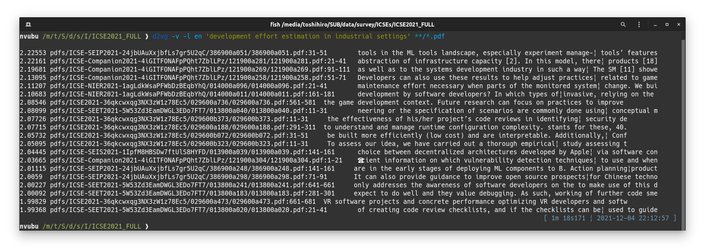
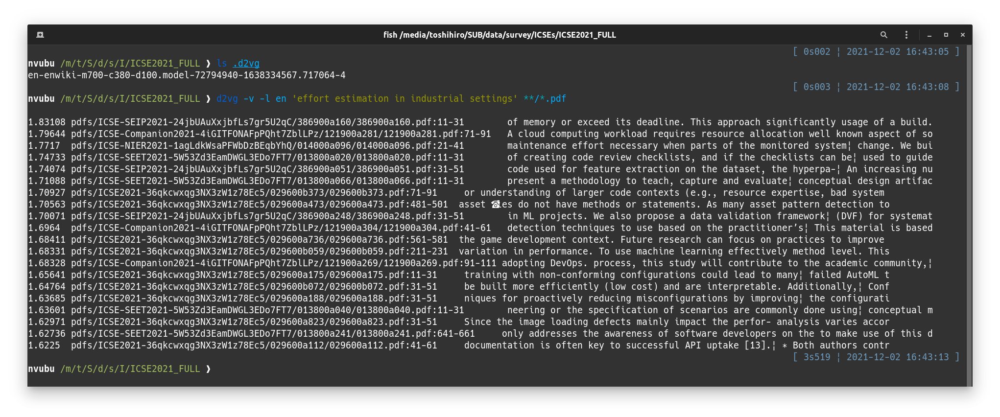

# d2vg

d2vg, a Doc2Vec grep.

Use Doc2Vec models to search document files that contain similar parts to the phrase in the query.

* Supports searching within text files (.txt), PDF files (.pdf), and MS Word files (.docx)
* Supported languages are Japanese and English (Since Doc2Vec model is language-dependent)
* Performance gain by indexing

## Installation

* &rarr; [Installation on Ubuntu](docs/installation-on-ubuntu.md)
* &rarr; [Installation on Windows](docs/installation-on-windows.md)

## Usage

```sh
d2vg -v <query_phrase> <files>...
```

If the OS's language is not `en_US`, you need to add option `-l en`:

```sh
d2vg -l en -v <query_phrase> <files>...
```

Example:  


### Indexing for x10 speedup

By letting d2vg create indexes of document files, you can improve the speed of the second and later searches from the same set of documents.

d2vg creates and refers to an index DB when the following conditions are satisfied.

* The current directory of running d2vg has a subdirectory named `.d2vg`.
* The target documents are specified as relative paths.

So, you can start indexing by changing the directory of the document fies and making a `.d2vg` directory.

```sh
cd <the/document/directory>
mkdir .d2vg
```

The index DB is updated incrementally each time you perform a search.
That is, when a new document is added and becomes the target of the search, the index data of that document is created and added to the index DB.

On the other hand, there is no function to automatically remove the index data of deleted documents from the database, so you should explicitly remove the `.d2vg` directory if necessary.

```sh
cd <the/document/directory>
rm -rf .d2vg
```

Example of execution with indexes enabled:  
(In this example, it took 9 minutes without indexing, but it was reduced to 25 seconds.)  


## Development

For instructions on how to create a Doc2Vec model, please refer to the script I used to create the English Doc2Vec model in `making_doc2vec_model/`.
The attached model has a vocabulary of 50K words and represents a document as a vector of 100 dimensions.
If you feel it is not enough, you can run the modified script to create an enhanced model.

### Doc2Vec model distribution files

The Doc2Vec model should be created with Gensim v4.

Prepare a file named `<language.ref>` (the `language` is a name of language specified with the option `-l`), contains the relative path to the Doc2Vec model file.

For example, in the case of Japanese Doc2Vec model, the content of the file `ja.ref` is the line `jawiki-w50k-d100.model`.

````
~/.config/d2vg/models/jaw50k
├─ ja.ref
├─ jawiki-w50k-d100.model
└─ jawiki-w50k-d100.model.dv.vectors.npy
````

## Todo

- [x] Optimization by indexing document files
- [x] Prepare Doc2Vec models compatible to the latest gensim (v4) 
- [x] Check installation on Windows.
- [ ] Combining keyword search
- [ ] Consider other models (in particular, could the Word2Vec model be used?)
- [ ] Support for more languages

## Acknowledgements

I referred to the following sites to create the Doc2Vec model. Many thanks.

* [Doc2vec model trained on Japanese Wikipedia](https://yag-ays.github.io/project/pretrained_doc2vec_wikipedia)

## License

d2vg is distributed under [BSD-2](https://opensource.org/licenses/BSD-2-Clause) license.

You need to follow the license of the distributors for the above Doc2Vec models.
