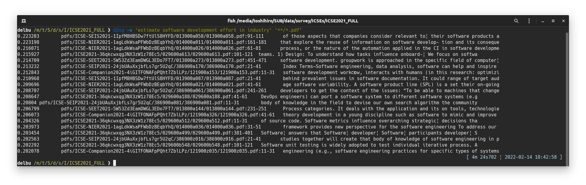
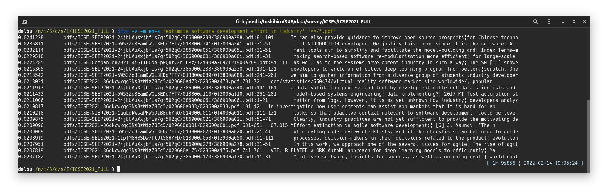
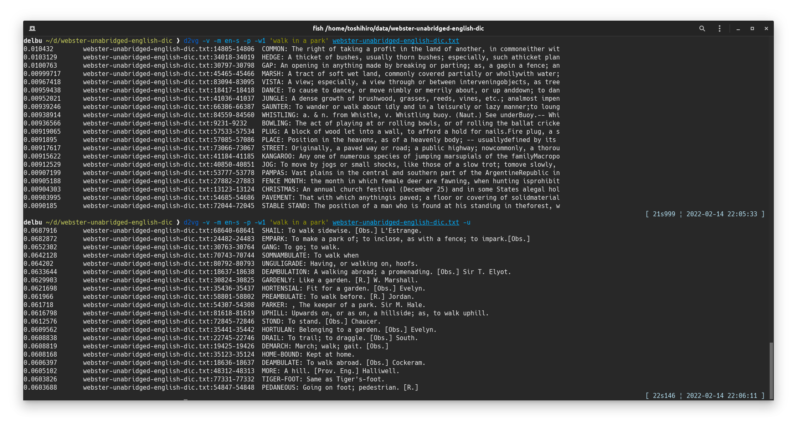

&rarr; doc [main](https://github.com/tos-kamiya/d2vg/) | [dev](https://github.com/tos-kamiya/d2vg/tree/dev)  
&rarr; Japanese doc [main](https://github.com/tos-kamiya/d2vg/blob/main/README.ja_JP.md) | [dev](https://github.com/tos-kamiya/d2vg/blob/dev/README.ja_JP.md)  

# d2vg

d2vg, a Doc2Vec grep (but also uses sentence transformer models, despite the name)

Use Doc2Vec models and sentence transformer models to search document files that contain similar parts to the phrase in the query.

* Supports searching within text files (.txt), PDF files (.pdf), and MS Word files (.docx)
* Search performance gain by index DB

## Installation

&rarr; [Installation on Ubuntu](docs/installation-on-ubuntu.md)  
&rarr; [Installation on Windows](docs/installation-on-windows.md)  

By default, `d2vg` uses a sentence transformer model for multiple languages.

## Usage

```sh
d2vg -v <query_phrase> <document_files>...
```

Example of a search:  


This example shows a search from 441 PDF files. With the default model, the peak memory usage was 5.4 GiB.

### TL;DR (typical usage)

(In advance, please follow the "Installing the language-specific Doc2Vec model" instruction in the installation.)

(1) Search for the document files similar to the query phrase.

```sh
d2vg -v -m en-s <query_phrase> <document_files>...
```

(2) Search for document files that are close to the query phrase with indexing the files to repeat the search many times with different queries.
(You need to specify the document file as a relative path in this command line.)

```sh
mkdir .d2vg
d2vg -v -m en-s <query_phrase1> <document_files>...
d2vg -v -m en-s <query_phrase2> <document_files>...
```

### Command-line options

`d2vg` has several options.  Here are some options that may be used frequently.

`--verbose, -v`  
Verbose option. If specified, it will show the progress and the documents that have the highest similarity up to that point while the search is in progress.

`--model=MODEL, -l MODEL`.  
Use a model other than the default. The available models are `en-s`, `ja` and `ja-s`.
Without the model option, the default multilingual model will be used.

`--top-n=NUM, -t NUM`  
Show top NUM documents as results. The default value is 20.
Specify `0` to show all the documents searched, sorted by the degree of match to the query.

`--paragraph, -p`  
If this option is specified, each paragraph in one document file will be considered as a document. Multiple paragraphs of a single document file will be output in the search results.
If this option is not specified, one document file will be considered as one document. A single document file will be displayed in the search results only once at most.

`--window=NUM, -w NUM`  
A chunk of lines specified by this number will be recognized as a paragraph.
The default value is 20.

`--unit-vector, -u`  
Normalize distributed representations of documents into unit vectors when calculating similarity to query phrases. When the length difference between paragraphs is large, the shorter paragraphs will be given priority in the search results. 

`--worker=NUM, -j NUM`
Number of worker processes. `0` is interpreted as a number of CPU cores.
This may speed up searches, especially when searching from documents that have not been indexed.

### Using the language-specific model

By default, a multilingual sentence transformer model is used for search.
The `--model` option allows you to search using a specific language model. 
For example, you can use `-m en-s` to use the model for English.

The suffix `-s` of model `en-s` stands for "small"; a smaller vocabulary and file size than the default multilingual model. The amount of memory required at runtime is smaller as well.
Even if the same document files are searched, the search results will be different between the default model and `en-s`.

Example usage of option `-m`  


(Note) To use the English-specific model (option `-m en-s`), you need to follow the instructions "Install language-specific Doc2Vec model files" during installation.

### Indexing

&rarr; [Indexing](docs/usage-indexing.md)

### Search individual lines of a text file

If you specify the options `--paragraph` and `--window=1` at the same time, you can search for individual lines in a text file. 
Longer texts (longer lines) are more likely to be found in the search results, so you should also specify `--unit-vector` if necessary.

Example of searching from dictionary data [Webster's Unabridged English Dictionary](https://www.gutenberg.org/ebooks/29765):  


(The text file for the dictionary data was generated by processing the json file available at https://github.com/adambom/dictionary.)

## Troubleshooting

| Symptom | Solution |
| --- | --- |
| **Installation of d2vg fails** with an error message saying that "pdftotext" cannot be installed.  | The pdftotext cannot be installed with the pip command alone. Please refer to the installation instructions. |
| d2vg's **search takes a very long time**. | If `cuda`-enabled `torch` is not installed, the default model takes a very long time to compute. (Depends on the situation, but it took 10 times longer than other models when I tried it.) To use a lightweight model, follow the instructions of "Install language-specific Doc2Vec model files" during installation, and then specify the option `-m en-s` on the command line. |
| d2vg **hangs**.  | When indexing is enabled (creating a directory `.d2vg`), force quitting may cause d2vg to hang because it cannot open the indexed DB the next time it is run. Please delete the directory `.d2vg`. |

## Todos

- [x] DB structure change for performance
- [x] batch indexing control command in case millions of document files to search
- [x] Utilizing the sentence transformer models
- [ ] License compatibility? (gensim's LGPL2)

## Acknowledgements

I referred to the following sites to create the Doc2Vec model:  
[Doc2vec model trained on Japanese Wikipedia](https://yag-ays.github.io/project/pretrained_doc2vec_wikipedia) (in Japanese)

Thanks to Wikipedia for releasing a huge corpus of languages:  
https://dumps.wikimedia.org/

## License

d2vg is distributed under [BSD-2](https://opensource.org/licenses/BSD-2-Clause) license.

