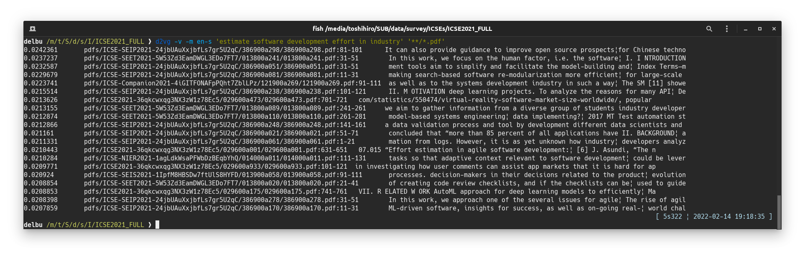

&rarr; doc [main](https://github.com/tos-kamiya/d2vg/) | [dev](https://github.com/tos-kamiya/d2vg/tree/dev)  
&rarr; Japanese doc [main](https://github.com/tos-kamiya/d2vg/blob/main/README.ja_JP.md) | [dev](https://github.com/tos-kamiya/d2vg/blob/dev/README.ja_JP.md)  

**WARNING: In the dev branch, an experiment to change the structure of the DB is currently underway. The index DB created with the alpha or beta release will not be usable in the official release.**

# d2vg

d2vg, a Doc2Vec grep (but also uses sentence transformers, despite the name)

Use Doc2Vec models and sentence transformers model to search document files that contain similar parts to the phrase in the query.

* Supports searching within text files (.txt), PDF files (.pdf), and MS Word files (.docx)
* Performance gain by indexing

## Installation

&rarr; [Installation on Ubuntu](docs/installation-on-ubuntu.md)  
&rarr; [Installation on Windows](docs/installation-on-windows.md)  

By default, `d2vg` uses the sentence transformers model for multiple languages.

## Usage

```sh
d2vg -v <query_phrase> <files>...
```

Example of a search:  


This example shows a search from 441 PDF files. The peak memory usage was 5.4 GiB.

### Options

`d2vg` has several options.  Here are some options that may be used frequently.

`--verbose, -v`  
Verbose option. If specified, it will show the progress and the documents that have the highest similarity up to that point while the search is in progress.

`--model=MODEL, -l MODEL`.  
Select a Doc2Vec model for the language. The available models are `en-s`, and `ja-s`.
Without the model option, the default multilingual model will be used.
The reason for the suffix `-s` of these model names is that each of the models has a smaller vocabulary and file size than the default multilingual model. The amount of memory required at runtime is smaller as well.

`--top-n=NUM, -t NUM`  
Show top NUM documents as results. The default value is 20.
Specify `0` to show all the documents searched, sorted by the degree of match to the query.

`--paragraph, -p`  
If this option is specified, each paragraph in one document file will be considered as a document. Multiple paragraphs of a single document file will be output in the search results.
If this option is not specified, one document file will be considered as one document. A single document file will be displayed in the search results only once at most.

`--window=NUM, -w NUM`  
A chunk of lines specified by this number will be recognized as a paragraph.
The default value is 20.

`--unit-vector, -u`  
Normalize distributed representations of documents into unit vectors when calculating similarity to query phrases. When the length difference between paragraphs is large, the shorter paragraphs will be given priority in the search results. 

`--worker=NUM, -j NUM`
Number of worker processes. `0` is interpreted as a number of CPU cores.
This may speed up searches, especially when searching from documents that have not been indexed.

### Using the language-specific model

By default, the multilingual sentence transformers model is used for search.
The `--model` option allows you to search using a specific language model. 
For example, you can use `-m en-s` to use the model for English.

The search results will differ between the default model and the language-specific model.
The memory usage and time required for searching are also different.

Example of a search using the English-specific Doc2Vec model with option -m  


(Note) To use the English-specific model, you need to follow the instructions "Install language-specific Doc2Vec model files" during installation.

### Search individual lines of a text file

If you specify the options `--paragraph` and `--window=1` at the same time, you can search for individual lines in a text file. 
As for the English-specific model, longer texts (longer lines) are more likely to be found in the search results, so you should also specify `--unit-vector` if necessary.

Example of searching from dictionary data [Webster's Unabridged English Dictionary](https://www.gutenberg.org/ebooks/29765:  


(The text file for the dictionary data was generated by processing the json file available at https://github.com/adambom/dictionary.)

### Incremental Indexing

By letting d2vg create indexes of document files, you can improve the speed of the second and later searches from the same set of documents.

d2vg creates and refers to an index DB when the following conditions are satisfied.

* The current directory of running d2vg has a subdirectory named `.d2vg`.
* The target documents are specified as relative paths.

So, you can start indexing by changing the directory of the document files and making a `.d2vg` directory.

```sh
cd the/document/directory
mkdir .d2vg
```

The index DB is updated incrementally each time you perform a search.
That is, at the timing when a new document file has been added and gets searched, the index of that document file is created and added to the index DB.

On the other hand, there is no function to automatically remove the index data of deleted document files from the database, so you should explicitly remove the `.d2vg` directory if necessary.

```sh
cd the/document/directory
rm -rf .d2vg
```

For DOS prompt or Powershell, use `rd /s /q .d2vg` or `rm -r -fo .d2vg`, respectively.

Example of a search with indexing enabled:  


In this example, it took 1 minute without indexing, but it was reduced to 5 seconds or so.

### Explicit indexing and searching within the index

There is a method to explicitly create an index and search within the index, especially assuming searching millions of document files.

The explicit indexing and the (regular) incremental indexing share (access) the same index DB.
Therefore, explicit index creation and searching within an index can be mixed with incremental indexing. For example, index creation can be done by incremental indexing, and search can be done within the index.

(1) Creating an index

In this explicit index creation, models are loaded as many times as the number of worker processes, and the index data are created in parallel and stored in the index DB. Note that it requires a large amount of memory.

```sh
cd directory of document files
d2vg --update-index -j <worker_processes> <files>...
```

While the `-j` option for incremental indexing parallelizes the process of reading text from a document file and tokenizing it (converting it into a sequence of words), the `-j` option for explicit indexing parallelizes the process of embedding text into vectors in addition to parsing document files.

Example of explicit indexing in action:  


(2) Searching within the index

Query the index DB in a parallel way. Document files which is not in the index DB will not be searched, and the index DB will not be updated.

```sh
cd directory of document files
d2vg -I -j <worker_processes> <query_phrase>
```

Example of searching within the index. Over 10 million text files, in 6 minutes or so:  


(3) Listing of indexed document files

Outputs a list of document files whose index data is stored in the database.
Note that if you have a large number of files, it is recommended to run the program in parallel using the -j option.

```sh
cd directory of document files
d2vg --list-indexed -j <worker_processes>
```

If you have a large number of document files and you are sure that they will not be updated so often, I strongly recommend that you use explicit indexing.

## Troubleshooting

**Q**: **Installation of d2vg fails** with an error message saying that "pdftotext" cannot be installed.  
**A** The pdftotext cannot be installed with the pip command alone. Please refer to the installation instructions.  

**Q**: d2vg's **search takes a very long time**.  
**A**: If `cuda`-enabled `torch` is not installed, the default (sentence trance formers model) takes a very long time to compute. Please follow the instructions of "Install language-specific Doc2Vec model files" during installation, and then specify the option `-m en-s` on the command line.

**Q**: d2vg **hangs**.  
**A**: When indexing is enabled (creating a directory `.d2vg`), force quitting may cause d2vg to hang because it cannot open the indexed DB the next time it is run. Please delete the directory `.d2vg`.

## Todos

- [x] Optimization by indexing document files
- [x] Prepare Doc2Vec models compatible with the latest gensim (gensim v4) 
- [x] Check installation on Windows
- [x] Combining keyword search
- [x] Easy installation
- [x] DB structure change for performance (v2)
- [x] Explicit indexing control command in case millions of document files to search (v2)
- [x] Utilizing the sentence transformers model (v2)

## Acknowledgements

I referred to the following sites to create the Doc2Vec model:  
[Doc2vec model trained on Japanese Wikipedia](https://yag-ays.github.io/project/pretrained_doc2vec_wikipedia) (in Japanese)

Thanks to Wikipedia for releasing a huge corpus of languages:  
https://dumps.wikimedia.org/

## License

d2vg is distributed under [BSD-2](https://opensource.org/licenses/BSD-2-Clause) license.

