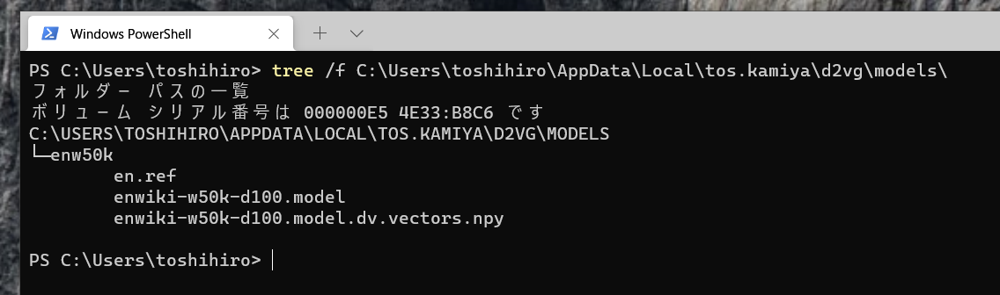
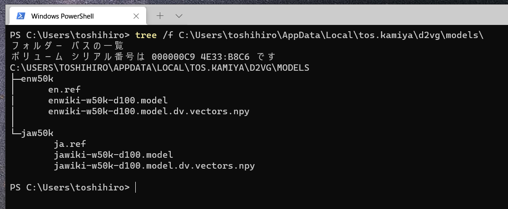
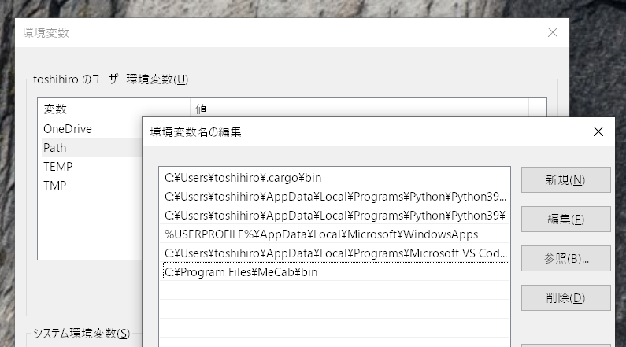
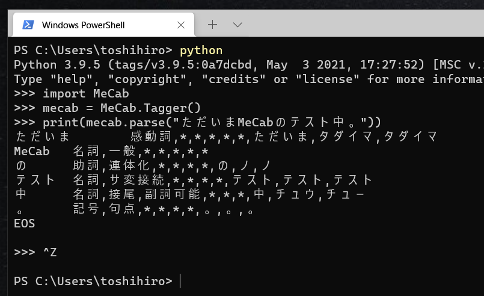

## Windowsでのインストール

(1) 依存やd2vをインストールします。

[Chocolatey](https://chocolatey.org/)を利用している場合には、Popplerを次でインストールしてください。

```
choco install poppler
```

Popplerを手動でインストーする場合には、まず、Popplerを次のページからダウンロードして展開してください。

https://blog.alivate.com.au/poppler-windows/

次に、展開した先の、`pdftotext.exe`があるディレクトリ（例えば、展開した先が "C:\Users\toshihiro\apps\poppler-0.68.0_x86\poppler-0.68.0" なら "C:\Users\toshihiro\apps\poppler-0.68.0_x86\poppler-0.68.0\bin\" )にPATHを通してください。

DOSプロンプト等から、pdftotextを実行できることを確認してください。


`d2vg`を次のようにしてインストールしてください。

```
pip install wheel
pip install d2vg[ja]
```

(2) 英語Doc2Vecモデルのファイルをインストールします。

releasesのページからダウンロードしたファイル `enw50k.tar.bz2.aa` と `enw50k.tar.bz2.ab` を連結します。

DOSプロンプトで行う場合は次のようになります。

```
C:
cd C:\Users\<username>\Downloads
copy /y /b "enw50k.tar.bz2.aa"+"enw50k.tar.bz2.ab" "enw50k.tar.bz2"
```

ファイル `enw50k.tar.bz2` を何らかのツールを使って展開します。
例えば、7-zipを使った場合は、1回展開するとファイル `enw50k.tar` が生成されるので、このファイルを再度展開します。

展開してできるディレクトリ `enw50k` を置くディレクトリ
`C:\Users\<username>\AppData\Local\tos.kamiya\d2vg\models`
を作成します。

DOSプロンプトで行う場合は次のようになります。

```
C:
cd C:\Users\<username>\AppData\Local
mkdir tos.kamiya
mkdir tos.kamiya\d2vg
mkdir tos.kamiya\d2vg\models
```

エクスプローラーで行う場合には、 `AppData` は隠しフォルダなので、
開くには、エクスプローラーのバーに直接「`C:\Users\<username>\AppData`」と入力してください。

ディレクトリ `enw50k` を `C:\Users\<username>\AppData\Local\tos.kamiya\d2vg\models` の直下のディレクトリになるように移動します。

次のようなディレクトリ構造になります。



(3) 日本語Doc2Vecモデルをインストールします。

releasesのページからファイル `jaw50k.tar.bz2` をダウンロードし、上の(2)に準じてインストールしてください。



(4) 形態素解析ツールをインストールします。

MeCab本体をインストールします。

https://github.com/ikegami-yukino/mecab/releases

「コントロールパネル-システムとセキュリティ-システム-システムの詳細設定-環境変数」で「Path」を編集して「C:\Program Files\MeCab\bin」を追加します。



動作確認には、DOSプロンプト等で次のように入力してみてください。

```
python
import MeCab
mecab = MeCab.Tagger()
print(mecab.parse("ただいまMeCabのテスト中。"))
```

次のように表示されれば、動作しています。



(5) NKFのインストール(オプション)

**文字コードがUTF-8のテキストファイルも検索対象にするには、NKFをインストールしてください。**
(いわゆるShiftJISのテキストファイルと、UTF-8のテキストファイルが混在しているときに、NKFを用いることで、文字コードを判別して読み込みます。)

[ネットワーク用漢字コード変換フィルタ シフトJIS,EUC-JP,ISO-2022-JP,UTF-8,UTF-16](https://www.vector.co.jp/soft/win95/util/se295331.html)
からダウンロードして展開したディレクトリ「vc2005win32(98,Me,NT,2000,XP,Vista,7)Windows-31J」の中にあるファイル`nkf32.exe`を利用します。

d2vgをインストールしたディレクトリを、DOSプロンプトなどで次を実行することで確認してください。

```
python -c "help('d2vg')"
```

`__init__.py`というファイルがあるディレクトリに、先の`nkf32.exe`をコピーしてください。

### 実行時の注意

オプション`-v`(検索の途中経過を表示する)はANSIエスケープシーケンスを出力するため、
ANSIエスケープシーケンスに対応したPowerShell等を利用してください。


