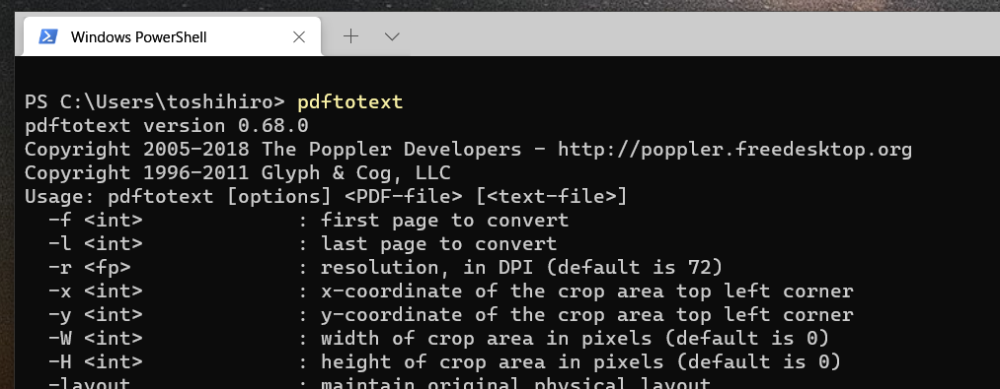
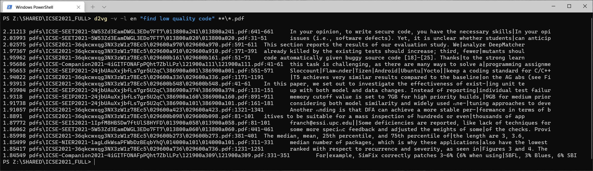

## Installation on Windows

(1) Install the dependencies and d2vg. **(Required)**

If you are using [Chocolatey](https://chocolatey.org/), you can install Poppler as follows:

```sh
choco install poppler
```

If you want to install Poppler manually, first download and extract Poppler from the following page.

https://blog.alivate.com.au/poppler-windows/

Then, add a directory where `pdftotext.exe` is located to your PATH. For example, if the extracted directory is "C:\Users\toshihiro\apps\poppler-0.68.0_x86\poppler-0.68.0" then add "C:\Users\toshihiro\apps\pdftotext.exe poppler-0.68.0_x86\poppler-0.68.0\bin\" to PATH.

Make sure you can run pdftotext from a DOS prompt, etc.



Install `d2vg` as follows.

```sh
pip install wheel
pip install d2vg
```

In order to use non-English Doc2Vec models, depending on the language, you may need to add an option such as `[ja]`.

```sh
pip3 install d2vg[ja]
```

(2) Install language-specific Doc2Vec model files. **(Recommended)**

By default, d2vg uses the sentence transformers model for multiple languages, but it is recommended that you install the Doc2Vec model that is specific to a particular language.

Download the Doc2Vec model file from the github release page.

For example, to install English Doc2Vec model, downloaded a file `enwiki-m700-c380-d100.tar.bz2` and set up it with `d2vg-setup-model`.

```sh
d2vg-setup-model the/downloaded/directory/enwiki-xxxxxxxx.tar.bz2
```

Use d2vg's ``--list-model`` option to check if the installation is successfully done.

```sh
> d2vg --list-model
en 'C:\\Users\\<username>\\AppData\\Local\\tos.kamiya\\d2vg\\models\\enwiki-xxxxxxxx\\en-s.model.toml'
```

If you have any problems, it is possible that you still have the old Doc2Vec model.
Please remove the installed Doc2Vec model files as follows, and then perform the model-file installation procedure again.

```sh
d2vg-setup-model --delete-all
```

(3) Install index-search engine **(Optional)**

Download `sub_index_search-windows-10-x64.zip` from the release page, and then extract and copy the file `sub_index_search` to the bin directory of d2vg.

The bin directory of d2vg can be found as follows:

```sh
d2vg --bin-dir
```

### Note on running d2vg

The option `-v` (to show the progress of the search) will output ANSI escape sequences.
Use a terminal supporting ANSI escape sequences, such as PowerShell.


