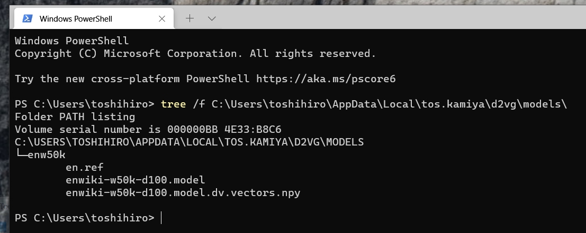

## Installation on Windows

(1) Install the dependencies and d2v with `Microsoft Visual C++ Build Tools`, `conda`, and `pip`.

Install `pdf2text` according to the instructions at https://github.com/jalan/pdftotext.

```
conda install -c conda-forge poppler
```

Install `d2vg` as follows.

```
pip install wheel
pip install git+https://github.com/tos-kamiya/d2vg.git
```

(2) Install an English Doc2Vec model file.

Concatenate the downloaded files `enw50k.tar.bz2.aa` and `enw50k.tar.bz2.ab`.

If you are doing this at the DOS prompt, it will look like this:

```
C:
cd C:\Users\<username>\Downloads
copy /y /b "enw50k.tar.bz2.aa"+"enw50k.tar.bz2.ab" "enw50k.tar.bz2"
```

Extract the file `enw50k.tar.bz2` with some tool.
For example, if you use 7-zip, expand it once to generate the file `enw50k.tar`, and then expand this file again.

Make a directory to store the extracted `enw50k` directory.

If you are doing this at the DOS prompt, it will look like this:

```
C:
cd C:\Users\<username>\AppData\Local
mkdir tos.kamiya
mkdir tos.kamiya\d2vg
mkdir tos.kamiya\d2vg\models
```

If you are using Explorer, since AppData is a hidden folder, enter `C:\Users\<username>\AppData` directly into the Explorer bar.

Move the directory `enw50k` so that it is directly under `C:\Users\<username>\AppData\tos.kamiya\d2vg\models` .



### Note on running the script

The option `-v` (to show the progress of the search) will output ANSI escape sequences.
Use a terminal supporting ANSI escape sequences, such as PowerShell.


