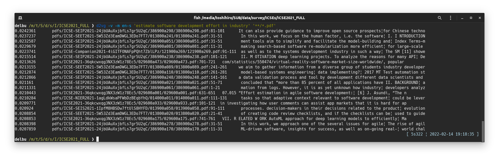
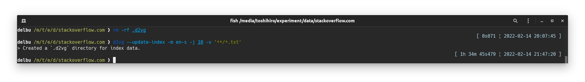
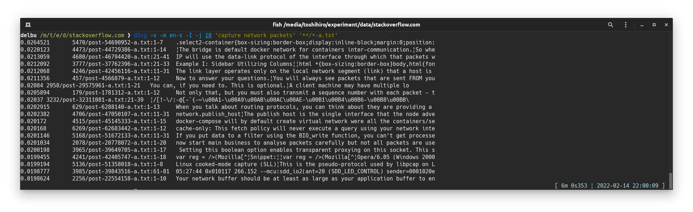

## インデックス化

d2vgで同じ文書ファイルを対象に繰り返し検索を行うときには、あらかじめそれらのファイルからインデックスDBを作成しておくことで、検索の性能を向上させることができます。

### インクリメンタルなインデックス化

インクリメンタルなインデックス化は、検索を行ったときに、対象となった文書ファイルのインデックス化を進めていく方法です。
対象の文書ファイルが変化したり追加されたときには、変化した/追加されたファイルに対してのみ（再）インデックス化が行われます。

d2vgは以下の条件のときに、インクリメンタルにインデックスDBを作成します。

* d2vgを実行するときのカレントディレクトリに`.d2vg`というサブディレクトリがある
* 対象の文書ファイルが相対パスで指定されている

インデックス化を開始するには、文書ファイルがあるディレクトリに行って、 `.d2vg` ディレクトリを作成してください。

```sh
cd 文書ファイルのディレクトリ
mkdir .d2vg
```

インデックスDBは検索を行う度にインクリメンタルに更新されます。
すなわち、新しい文書ファイルが追加されて検索の対象になったタイミングで、その文書のインデックスを作成しインデックスDBに追加します。

その一方で、削除された文書ファイルのインデックスをデータベースから自動的に削除する機能は無いので、必要に応じて明示的に`.d2vg`ディレクトリを削除してください。

```sh
cd 文書ファイルのディレクトリ
rm -rf .d2vg
```

DOSプロンプトやPowershellの場合は、それぞれ、`rd /s /q .d2vg`あるいは`rm -r -fo .d2vg`としてください。

インデックス化を有効にしたときの検索の実行例:  


この例では、インデックス化をしていないときは1分かかっていたものが、5秒ほどに短縮されまた。

### バッチによるインデックス化とインデックス内からの検索

特に、数百万といった個数の（変更されないであろう）文書ファイルを対象とした検索を想定して、明示的にインデックスを作成しておき、そのインデックス内から検索する方法があります。

バッチによるインデックス化によるインデックスDBは、通常のインクリメンタルなインデックス化と共通のDBです。
したがって、バッチによるインデックスの作成やインデックス内からの検索は、インクリメンタルなインデックス化と併用することができます。例えば、インデックスの生成をインクリメンタルなインデックス化により行い、検索はインデックス内から行う、といったことが可能です。

**(1) インデックスの作成**

このインデックスの作成では、ワーカープロセスの数だけモデルをロードし、並列にインデックスを生成してインデックスDBに格納していきます。大量のメモリが必要となるので注意してください。

```sh
cd 文書ファイルのディレクトリ
d2vg --update-index -j <ワーカープロセスの数> <ファイル>...
```

インクリメンタルなインデックス化の場合の`-j`オプションは文書ファイルからのテキストの読み出しやトークン化（単語の並びへと変換）の処理を並列化するのに対して、バッチによるインデックス化の場合の`-j`オプションは文書ファイルのパースだけではなく、テキストを単語の並び変換する処理も並列化します。

バッチによるインデックス化の実行例:  


**(2) インデックス内からの検索**

インデックスDBに対して、並列に問い合わせを行います。インデックスDBにない文書ファイルは検索の対象にならず、また、インデックスDBが更新されることもありません。

```sh
cd 文書ファイルのディレクトリ
d2vg -I -j <ワーカープロセスの数> <クエリとなるフレーズ>
```

インデックス内からの検索の実行例:  


この例では、1千万個以上のテキストファイルから6分くらいで検索が完了しています。

**(3) インデックス化された文書ファイル一覧**

 データベースにインデックスデータが格納されている文書ファイルのリストを出力します。
ファイル数が多い場合は-jオプションを使って並列に実行することをおすすめします。

```sh
cd 文書ファイルのディレクトリ
d2vg --list-indexed -j <ワーカープロセスの数>
```

文書ファイルが大量で、あまり更新されないことがわかっている場合には、バッチによるインデックス化を是非利用してください。
